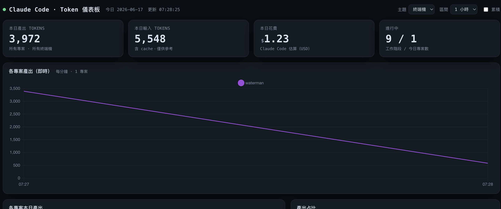

# CC Token 儀表板

> 即時監控你 Mac 上**所有正在執行的 Claude Code 終端機**的 token 產出。
> 常駐 macOS 選單列，點開可看各專案明細與含折線／長條／圈圖的全功能儀表板。

<p>
  
  
  
</p>

English version → [README.en.md](README.en.md)



---

## 這是什麼

一個單檔 Python 工具，幫你回答一個問題：**「我現在所有開著的 Claude Code，到底各自燒了多少 token？」**

它有三種角色（同一支程式、不同子指令）：

| 角色 | 子指令 | 說明 |
|------|--------|------|
| 收集器 | `status` | 給 Claude Code 的 **statusLine**，讀 stdin 的 JSON、寫下準確的 token 快照 |
| 全功能儀表板 | `serve` | 瀏覽器頁面：KPI + 即時折線 + 長條 + 圈圖 + 各專案明細表 |
| 選單列 | `menubar` | macOS 常駐選單列小工具（需 `rumps`），點開可開啟全功能頁 |

主程式：[`src/cc_token_dashboard.py`](src/cc_token_dashboard.py)。`status` / `serve` **純標準函式庫**，零外部相依；只有 `menubar` 與打包需要額外套件。

---

## 為什麼準（核心設計）

Claude Code 寫進 conversation JSONL 的 `output_tokens` 多為**串流中途值**（常是 1），拿來統計會低估 10～100 倍（見 [anthropics/claude-code#22686](https://github.com/anthropics/claude-code/issues/22686)）。

本工具**不讀那份 JSONL**，而是走 **statusLine**：Claude Code 每次狀態更新都會把 `context_window.total_output_tokens / total_input_tokens` 餵給 statusLine 指令，這個值與 API 計費 **1:1**，才是準確來源。

> 推論：statusLine 只在「**有工作階段在跑**」時 tick → 這正是「即時監控目前在跑的終端機」的特性，不是 bug。

---

## 安裝

需求：macOS 11+、`python3`（建議 Homebrew）。

### A. 免編譯（最省事）

```bash
pip3 install rumps          # 只需一次
make quick-app              # 產生 dist/quick/CCTokenDashboard.app
```

把 `.app` 拖進「應用程式」，首次需右鍵 →「打開」過 Gatekeeper。依賴系統的 `python3` + `rumps`。

### B. 自包含（不依賴系統 Python，可發佈）

```bash
make app                   # 用 py2app 打包，產生 dist/CCTokenDashboard.app + .dmg
```

自帶 Python.framework，本機產生不會被隔離、可直接雙擊。打包時會在 `Contents/Resources/` 放一份**鬆散的腳本副本**供收集器使用。

### C. 直接從原始碼跑

```bash
make run                   # 開瀏覽器儀表板 http://127.0.0.1:8787
make menubar               # 跑選單列（需先 pip3 install rumps）
```

---

## 接上資料來源（statusLine 收集器）

App 只負責「顯示」，token 由收集器寫入 `~/.claude/token-dashboard/events.jsonl`。兩者各自獨立。

打開儀表板後，照畫面「設定 statusLine 收集器」區塊把 JSON 合併進 `~/.claude/settings.json` 即可（指令路徑會自動填好）。手動設定的話：

```json
{
  "statusLine": {
    "type": "command",
    "command": "python3 /路徑/cc-token-dashboard/src/cc_token_dashboard.py status"
  }
}
```

> 若你已有自訂 statusLine，可在原本腳本最後加一行 `python3 …/cc_token_dashboard.py status` 來同時收集。

設好後回到任一個 Claude Code 工作階段繼續操作，資料就會開始進來，本頁每數秒自動更新。

---

## 專案如何分流

收集器以「**目前工作資料夾**」(`workspace.current_dir`) 判定專案，並往上找 `.git` / `.claude` / `package.json` 等專案根標記，把子目錄歸回專案本身。

所以即使你固定在家目錄啟動 `claude`，只要請它進某專案工作，token 就會**自動歸到該專案**——不必 cd 啟動、不必帶環境變數。

---

## 常用指令

```
make test                煙霧測試（不需 Claude Code，含彙整斷言）
make run                 開瀏覽器儀表板
make menubar             直接跑選單列（需 rumps）
make quick-app           免編譯 .app → dist/quick/
make app                 py2app 自包含 .app + .dmg → dist/
make install-statusline  印出要貼進 settings.json 的設定
make clean
```

---

## 資料流

```
Claude Code（每次狀態更新）
   │  stdin: { session_id, workspace.{project_dir,current_dir},
   │           model.display_name, cost.total_cost_usd,
   │           context_window.{total_output_tokens,total_input_tokens,used_percentage} }
   ▼
status 收集器  ──原子 append（單筆 <4KB，多終端機安全）──▶  events.jsonl
   ▼
Store（serve / menubar 共用）：增量讀檔、每 session 算 delta、今日彙整、連續分鐘時間序列
   ▼
/api/stats（JSON）→ 前端 Chart.js 每 3 秒輪詢
```

---

## 已知限制

- 數字僅在工作階段**執行中**（statusLine tick）才更新；顆粒度依 Claude Code tick 頻率。
- 折線圖預設由 CDN 載 Chart.js（離線環境可改內嵌）。
- 歷史 token 無法回溯重新分類（過去的 tick 不知道當時屬哪個專案）。

## Roadmap

- [ ] codesign + notarytool（需 Apple Developer ID），做出下載免警告的版本
- [ ] 選單列「一鍵設定 statusLine 收集器」（安全寫入 settings.json）
- [ ] 開機自動常駐（LaunchAgent）
- [ ] 歷史日切換 / 5 小時視窗 / 落地 SQLite 以利長期查詢

---

## 貢獻

歡迎 issue 與 PR，請先讀 [CONTRIBUTING.md](CONTRIBUTING.md)。動到收集器的 delta 邏輯，務必跑 `make test`。

## 授權

[MIT](LICENSE) © 2026 陳建文 (Rai)
